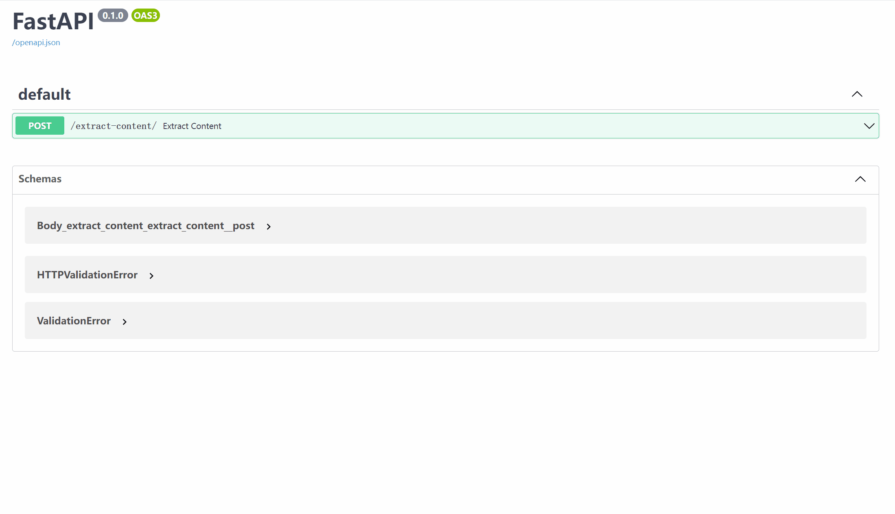

## **一、项目简介**
利用paddleocr和ollama本地推理大模型做图片关键信息抽取

操作流程demo

## **二、快速开始**
**程序运行方式：**

 - 运行uvicorn ocr_ollama_fastapi:app --host 0.0.0.0 --port 8000
 - 要访问生成的服务的 FastAPI 文档，请使用 Web 浏览器访问 http://localhost:8000/docs

## **三、联系方式**
如需要更多项目咨询，请联系

